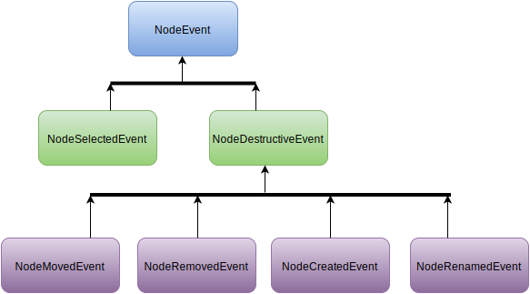

# :herb: ng2-branchy

ng2-branchy is a simple [Angular 2](https://github.com/angular/angular) component for visualizing data that can be naturally represented as a tree.

## :clapper: Usage
Ok, let's start with an installation - all you need to do is:

`npm install --save ng2-branchy`

Now when you have branchy installed you need to add it to your component's template and to the list of its directives:

```typescript
// 1 - import required classes and interfaces
import {BranchyComponent, TreeModel} from 'ng2-branchy';

@Component({
  selector: 'myComp',
  // 2 - add branchy to the template
  template: `
    <branchy [tree]="tree"></branchy>
    `,
  // 3 - add branchy to the list of directives
  directives: [BranchyComponent]
})
class MyComponent {
  ...
}
```

As soon as the previous step is done we need to give branchy a model to render - this can be accomplished by populating its `[tree]` attribute with an object that confirms to `TreeModel` interface (see [API](#wrench-api)):

```typescript
// 1 - import required classes and interfaces
import {BranchyComponent, TreeModel} from 'ng2-branchy';

@Component({
  selector: 'myComp',
  // 2 - set [tree] attribute to tree object
  template: `
    <branchy [tree]="tree"></branchy>
    `,
  directives: [BranchyComponent]
})
class MyComponent {
  // 3 - make sure tree object confirms to TreeModel interface
  private tree: TreeModel = {
    value: 'Programming languages by programming paradigm',
    children: [
      {
        value: 'Object-oriented programming',
        children: [
          {value: 'Java'},
          {value: 'C++'},
          {value: 'C#'},
        ]
      },
      {
        value: 'Prototype-based programming',
        children: [
          {value: 'JavaScript'},
          {value: 'CoffeeScript'},
          {value: 'Lua'},
        ]
      }
    ]
  };
}
```

Apart from that I suppose you'd want to listen for branchy's events (for a full list of supported events look at [API](#wrench-api)). No problem, this is also easy to do - for example let's add a listener for `node was selected` events:

```typescript
// 1 - import required classes and interfaces
import {BranchyComponent, TreeModel, NodeEvent} from 'ng2-branchy';

@Component({
  selector: 'myComp',
  // 2 - listent for nodeSelected events and handle them
  template: `
    <branchy [tree]="tree" (nodeSelected)="logEvent($event)"></branchy>
    `,
  directives: [BranchyComponent]
})
class MyComponent {
  private tree: TreeModel = { ... };

  // 3 - print caught event to the console
  private logEvent(e: NodeEvent): void {
    console.log(e);
  }
}
```
Voila! That's pretty much it - enjoy :blush:

## :eyes: Demo
Feel free to examine the [demo](https://rychkog.github.io/ng2-branchy) and its [sources](demo/) to find out how things are wired.

## :wrench: API

Here is the fully stuffed branchy tag that you can use in your templates:

```html
    <branchy
      [tree]="tree"
      (nodeRemoved)="handleRemoved($event)"
      (nodeRenamed)="handleRenamed($event)"
      (nodeSelected)="handleSelected($event)"
      (nodeMoved)="handleMoved($event)"
      (nodeCreated)="handleCreated($event)">
    </branchy>
```

Let's go through every element of this structure one by one.

### branchy

`branchy` is the selector for `BranchyComponent` which you can import like shown below:

```typescript
import {BranchyComponent} from 'ng2-branchy';
```

### [tree]

`branchy` has `[tree]` attribute which need to be populated with an object implementing `TreeModel` interface. You can import this interface as following

```typescript
import {TreeModel} from 'ng2-branchy';
```

Here is the definition of TreeModel interface:

```typescript
interface TreeModel {
  value: string | RenamableNode;
  children?: Array<TreeModel>;
}
```

As you can see it is recursive and can be represented as the following object:

```typescript
{
    value: 'Programming languages by programming paradigm',
    children: [
      {
        value: 'Object-oriented programming',
        children: [
          {value: 'Java'},
          {value: 'C++'},
          {value: 'C#'},
        ]
      },
      {
        value: 'Prototype-based programming',
        children: [
          {value: 'JavaScript'},
          {value: 'CoffeeScript'},
          {value: 'Lua'},
        ]
      }
    ]
  }
```

Property `value` can be of type `string` or `RenamableNode`.
`RenamableNode` gives you additional control over the way node is renamed and rendered (by rendered I mean its text representation). Here is the definition of `RenamableNode` interface:

```typescript
interface RenamableNode {
  setName(name: string): void;
  toString(): string;
}
```

Here is an example of such a node in the `TreeModel` object:

```typescript
{
    value: 'Programming languages by programming paradigm',
    children: [
      {
        value: 'Object-oriented programming',
        children: [
          {
            value: <RenamableNode>{
              name: 'Java',
              setName(name: string): void {
                this.name = name;
              },
              toString(): string {
                return this.name;
              }
            }
          },
          {value: 'C++'},
          {value: 'C#'},
        ]
      },
      {
        value: 'Prototype-based programming',
        children: [
          {value: 'JavaScript'},
          {value: 'CoffeeScript'},
          {value: 'TypeScript'},
        ]
      }
    ]
  };
```

### events (nodeMoved, nodeSelected, nodeRenamed, nodeRemoved, nodeCreated)

Here is the diagram that shows branchy events' hierarchy



`NodeEvent` is the root of branchy events' hierarchy. It defines property `node` that contains a receiver of the event's action (`node` confirms to `TreeModel`).


`NodeDestructiveEvent` is the parent for all events that cause changes to a structure of the tree or to a node value.
It defines property 'parent' that contains an object implementing 'TreeModel' interface and gives context to the event's action.

#### NodeSelectedEvent

You can subscribe to `NodeSelectedEvent` by attaching listener to `(nodeSelected)` attribute

```html
    <branchy
      [tree]="tree"
      (nodeSelected)="handleSelected($event)">
    </branchy>
```

`NodeSelectedEvent` has just one property `node` which contains `TreeModel` object of a selected node.

```typescript
{node: <TreeModel>{...}}
```

`NodeSelectedEvent` inherits its property directly from `NodeEvent`.

#### NodeMovedEvent

You can subscribe to `NodeMovedEvent` by attaching listener to `(nodeMoved)` attribute

```html
    <branchy
      [tree]="tree"
      (nodeMoved)="handleMoved($event)">
    </branchy>
```

`NodeMovedEvent` has two properties `node` and `parent` both of which contain `TreeModel` objects.
`node` contains moved node.
`parent` contains new parent of the moved node.

```typescript
{node: <TreeModel>{...}, parent: <TreeModel>{...}}
```

`NodeMovedEvent` inherits its properties from `NodeDestructiveEvent`.

#### NodeRemovedEvent

You can subscribe to `NodeRemovedEvent` by attaching listener to `(nodeRemoved)` attribute

```html
    <branchy
      [tree]="tree"
      (nodeRemoved)="handleRemoved($event)">
    </branchy>
```

`NodeRemovedEvent` has two properties `node` and `parent` both of which contain `TreeModel` objects.
`node` contains removed node.
`parent` contains parent of the removed node.

```typescript
{node: <TreeModel>{...}, parent: <TreeModel>{...}}
```

`NodeRemovedEvent` inherits its properties from `NodeDestructiveEvent`.

#### NodeCreatedEvent

You can subscribe to `NodeCreatedEvent` by attaching listener to `(nodeCreated)` attribute

```html
    <branchy
      [tree]="tree"
      (nodeCreated)="handleCreated($event)">
    </branchy>
```

`NodeCreatedEvent` has two properties `node` and `parent` both of which contain `TreeModel` objects.
`node` contains created node.
`parent` contains parent of the newly created node.

```typescript
{node: <TreeModel>{...}, parent: <TreeModel>{...}}
```

`NodeCreatedEvent` inherits its properties from `NodeDestructiveEvent`.

#### NodeRenamedEvent

You can subscribe to `NodeRenamedEvent` by attaching listener to `(nodeRenamed)` attribute

```html
    <branchy
      [tree]="tree"
      (nodeRenamed)="handleRenamed($event)">
    </branchy>
```

`NodeRenamedEvent` has four properties:

- `node` contains node that was renamed (implements `TreeModel`).
- `parent` contains parent (implements `TreeModel`) for the renamed node.
- `oldValue` contains value node used to have (it might be `string` or `RenamableNode`)
- `newValue` contains new value of the node (it might be `string` or `RenamableNode`)

```typescript
{
  node: <TreeModel>{...},
  parent: <TreeModel>{...},
  oldValue: <string|RenamableNode>{...},
  newValue: <string|RenamableNode>{...}
}
```

`NodeRenamedEvent` inherits its `node` and `parent` properties from `NodeDestructiveEvent`.

## :-1: Bad parts
Currently I feel really bad because of two things:
- branchy doesn't have tests (yet), so I wouldn't recommend you to use this in a production environment
- branchy doesn't have proper mechanism for customizing its look

## :thumbsup: Good parts
I really want to deminish all the [Bad parts](#-1-bad-parts) and extend branchy with a new stuff

## :bulb: Want to help?

I am very appreciate for your ideas, proposals and found bugs which you can leave in [github issues](). Thanks in advance!

**P.S.** If you find it hard going through documentation, please, let me know which parts of it was difficult to grasp and I will improve them.
